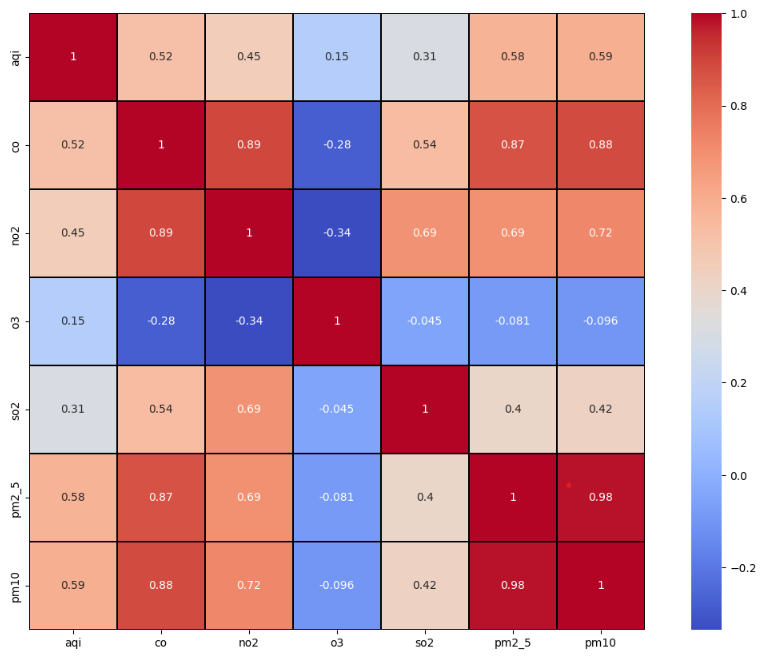
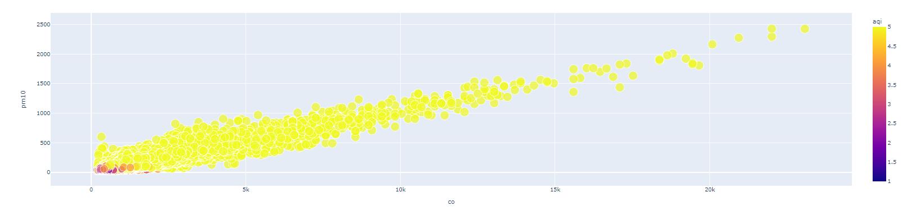
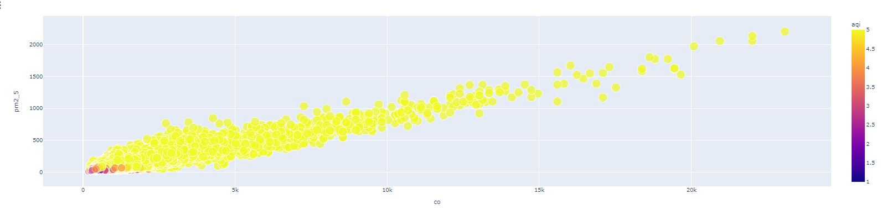
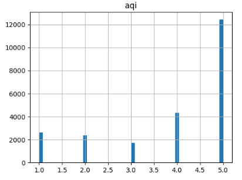
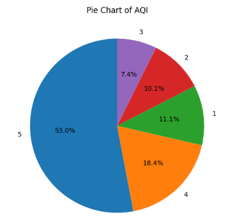

# Laporan Proyek Machine Learning - Imam Mulyana

## Klasifikasi Air Quality Index India

Polusi udara merupakan fenomena serius yang menghadirkan risiko besar terhadap kesehatan manusia dan keberlanjutan lingkungan. Atmosfer yang tercemar oleh berbagai polutan, baik berasal dari sumber alam maupun aktivitas manusia, dapat menyebabkan dampak yang signifikan. Terutama, kesehatan manusia dapat terancam dengan adanya gangguan saluran pernapasan, peningkatan risiko penyakit kardiovaskular, dan dampak buruk pada perkembangan anak-anak. Selain itu, dampak lingkungan yang merusak tanaman, ekosistem, dan menciptakan fenomena asidifikasi dapat memperburuk kondisi bumi.

Menurut VOA Indonesia dalam judul berita "Polusi Udara di New Delhi SOS, Beberapa Sekolah Terpaksa Ditutup" menyebutkan bahwa Warga di New Delhi berada pada kualitas udara tidak sehat karena diselimuti polusi yang beracun. Indeks kualitas udara (AQI) di beberapa bagian ibu kota India tersebut masuk ke dalam kategori "parah” sehingga mendorong pemerintah memerintahkan penutupan sejumlah sekolah.

Sumber polusi utama melibatkan emisi dari debu konstruksi, emisi kendaraan, dan asap dari pembakaran liar. Hal itu menyebabkan terjadinya lonjakan penyakit pernapasan di antara 20 juta penduduk kota tersebut.

Menurut survei WHO terhadap 1.650 kota global dan survei terhadap 7.000 kota global yang dilakukan oleh Health Effects Institute yang berbasis di AS pada Agustus 2022, kualitas udara di Delhi, wilayah ibu kota India, adalah yang terburuk dibandingkan kota-kota besar mana pun di dunia. Menurut perkiraan, polusi udara membunuh sekitar 2 juta orang India setiap tahunnya, menjadikannya penyebab kematian keenam di negara itu. Menurut WHO, India memiliki angka kematian tertinggi di dunia akibat asma dan gangguan pernapasan kronis. Di Delhi, 2,2 juta orang, atau 50% dari seluruh anak, mengalami kerusakan paru-paru yang tidak dapat diperbaiki.

Pada 19 November 2021, NASA menerbitkan laporan tentang masalah polusi udara di Delhi. Bloomberg melaporkan bahwa 16,7 lakh orang di India meninggal pada tahun 2019 akibat polusi udara. Pemerintah berupaya mengatasi bencana besar ini, namun tampaknya ini bukan tugas yang mudah.

Untuk menyelesaikan masalah tersebut pemerintah india mengerahkan alat penyiram air dan senjata antikabut untuk mengendalikan kabut dan banyak orang menggunakan masker untuk menghindari polusi udara, mengumumkan denda sebesar 20.000 rupee ($240) bagi pengemudi yang kedapatan menggunakan mobil berbahan bakar bensin dan solar, Bus dan truk yang menimbulkan kabut asap biasanya model berusia 10 hingga 15 tahun juga akan dikenai denda serupa, melakukan penutupan sekolah untuk menjaga kesehatan para siswa, menangguhkan proyek kontruksi demi mengurangi polutan partikel konstruksi, memperingatkan masyarakat tentang situasi kabut asap yang semakin buruk menjelang penyelenggaraan Diwali, festival cahaya Hindu yang menampilkan penyalaan petasan yang akan diadakan pada 12 November. dan mencegah para petani melakukan pembakaran sisa tanaman pada awal musim tanam gandum di musim dingin dengan menawarkan insentif tunai untuk membeli mesin guna melakukan pekerjaan tersebut guana menghilangkan pembakaran liar.

Beberapa cara untuk menyelesaikan masalah tersebut juga bisa melalui penerapan hasil riset sebagai pembanding penyelesaian masalah seperti citizen lawsuit yaitu memaksa masyarakat dengan regulasi hukum terkait lingkungan hidup, modifikasi cuaca untuk mengurangi dampak polusi udara, sosialisasi dan edukasi kesemua elemen masyarakat terutama penyumbang polusi udara yaitu para petani pembakar sisa tanaman, penggunaan kendaraan umum, tranformasi industri ke ramah lingkungan, peremajaan kendaraan umum, dan SOP terkait pengelolaan pembangunan kontruksi yang memiliki dampak polutan partikel debu.

## Business Understanding

Dampak kesehatan masyarakat yang signifikan akibat polusi udara di India adalah lonjakan infeksi saluran pernapasan seperti flu, bronkitis dan asma akut di antara penduduk kota yang mencapai 20 juta orang sehingga menimbulkan risiko kesehatan publik yang tinggi. Potensi kerugian ekonomi juga dapat terlihat dari penutupan sekolah yang dapat menghambat aktivitas pendidikan, mobilitas masyarakat, dan penangguhan proyek kontruksi.

Oleh karena itu diperlukan prediksi sedini mungkin terhadap kualitas udara demi menghindari dampak negatif akibat polusi udara dengan model klasifikasi karena termasuk dalam permasalahan identifikasi dengan label (supervised learning) dan fitur aqi sebagai target. Adapun model yang digunakan adalah Decision Tree dan Random Forest.Metrik evaluasi yang digunakan pada pemodelan klasifikasi ini adalah confusion metrik yang terdiri dari akurasi, presisi, recall, dan F1 Score

### Problem Statements

1. Dari serangkaian fitur yang ada, fitur apa yang paling berpengaruh terhadap Air Quality Index?
2. Bagaimana menjaga agar Air Quality Index tetap pada kategori baik atau bagus?

### Goals

1.  Mengetahui fitur yang paling berkorelasi dengan kualitas udara.
2.  Membuat model machine learning yang dapat memprediksi kualitas udara sedini mungkin berdasarkan fitur-fitur yang ada.

### Solution statements

1.  Menerapkan model machine learning klasifikasi: Decisio Tree dan Random Forest untuk memprediksi tingkat kualitas udara di wilayah tertentu berdasarkan variabel co, no2, o3, so2, pm2_5, dan pm10.
2.  Memberikan pemberitahuan dini kepada masyarakat dan otoritas terkait ketika tingkat polusi suatu daerah sudah terklasifikasi.

## Data Understanding

Data yang digunakan merupakan Air Quality Index di negara india dengan rentang waktu 2020 - 2023 yang terdiri dari 9 fitur, namun hanya 6 fitur yang digunakan yaitu city, aqi, co, no2, o3, so2, pm2_5, dan pm10. Pemilihan fitur 'city' adalah untuk mengetahui dimana pengamatan dilakukan, pemilihan fitur 'aqi' adalah untuk mengetahui cluster atau kategori kualitas udara serta sebagai label fitur target karena menggunakan supervised learning, sedangkan pemilihan co, no2, o3, so2, pm2_5, dan pm10 dilandaskan pada fitur yang digunakan pada website Air Quality Index India sebagai zat polutan yang dipantau dalam parameter. Adapun penghapusan 3 fitur dari 9 fitur dataset dikarenakan fitur 'date' tidak diperlukan dalam proses klasifikasi, fitur 'nh3' tidak tersedia di dataset Air Quality index New Delhi sebagai data uji coba sehingga jika tidak dihapus akan terjadi perbedaan fitur antara dataset Air Quality India dan Air Quality New delhi, dan fitur 'no' tidak dimasukkan karena fitur tersebut di web AQI India tidak dimasukkan kedalam parameter zat polutan yang diukur.

Teknik pengumpulan data adalah melalui observasi secara realtime yaitu pengumpulan data melalui pengamatan langsung terhadap perilaku atau situasi oleh lembaga Central Pollution Control Board dibawah naungan Kementerian Lingkungan, Kehutanan, dan Iklim India

Jumlah data yang digunakan pada studi kasus ini adalah 23.504 yang tersebar di 26 kota negara India. Adapun terkait data missing value terdapat pada kolom 'o3' dimana ada sekitar 1551 data bernilai 0 oleh karenanya dilakukan handling missing value dengan teknik droup out dengan alasan jumlah dataset yang besar tidak akan terpengaruh, dan karena dataset ini menggunakan satuan ukur dalam μg/m3 dan untuk parameter AQI India dalam mg/m3 maka perlu diperhatikan nilai satuannya (μg/m3 ke mg/m3, sama dengan dibagi 10).

### Variabel-variabel pada AQI India dataset adalah sebagai berikut:

Dataset ini berisi data Polusi Udara harian tahun 2020 hingga tahun 2023, dengan rincian sebagai berikut:

| Feature | Deskripsi                                                                                                                                   |
| ------- | ------------------------------------------------------------------------------------------------------------------------------------------- |
| CITY    | Nama Kota di India tempat kualitas udara diukur[PlDb]                                                                                       |
| AQI     | Karbon Monoksida, gas tidak berwarna dan tidak berbau yang dihasilkan oleh pembakaran tidak sempurna bahan bakar fosil dan biomassa[PlGd]   |
| CO      | Nitric Oxide, gas berbahaya yang dihasilkan dari pembakaran bahan bakar fosil dan proses industri.[PlOd]                                    |
| O3      | Ozon, gas yang terbentuk ketika sinar matahari bereaksi dengan polutan seperti nitrogen oksida dan senyawa organik yang mudah menguap[PlGa] |
| PM2.5   | Partikulat (PM) dengan diameter 2,5 mikrometer atau kurang, yang berhubungan dengan polusi partikel halus.[PlGa]                            |
| PM10    | Partikulat (PM) dengan diameter 10 mikrometer atau kurang, yang berhubungan dengan polusi partikel kasar.[PlGa]                             |

Notes: Semua kolom polutan berikut diukur dalam μg/m3

Kota :
Ahmedabad, Aizawl, Amaravati, Amritsar, Bengaluru, Bhopal, Brajrajnagar, Chandigarh, Chennai, Coimbatore, Delhi, Ernakulam, Gurugram, Guwahati, Hyderabad, Jaipur, Jorapokhar, Kochi, Kolkata, Lucknow, Mumbai, Patna, Shillong, Talcher, Thiruvananthapuram, Visakhapatnam

### Exploratory Data Analysis:

**Mendiskripsikan variabel:**

- Melihat Jenis variabel pada dataset
- Melihat value count dari aqi dibedakan menjadi 5 : 1.Baik (0-50), 2.Memuaskan (51-100), 3.Sedang (101-200), 4.Buruk (201-300), Sangat Buruk (301-400), 5.Parah (401-500), atau tingkat Berbahaya (500+).

**Handling Missing Value**

- Melakukan pengecekan missing value dan outlier, metode yang digunakan untuk mengatasi outlier adalah IQR yaitu dengan cara mengukur sebaran data dan menghitung selisih antara nilai kuartil ketiga (Q3) dan kuartil pertama (Q1), membantu identifikasi dan analisis pencilan (outliers) dalam suatu set data.

**Univariate Analysis**

- Mengecek korelasi antar fitur, dimana semua fitur input memiliki korelasi yang positif dan cenderung menguatkan terhadap fitur target yaitu 'aqi' kecuali fitur 'o3' dan 'so2' yang memiliki korelasi positif namun lemah
  
- mengecek hubungan co dengan pm10 dan pm25 yang merupakan faktor signifikan
  
  
- Mengecek distribusi data, dimana distribusi fitur aqi pada kategori 5 sangat tinggi dibanding kategori 1-4. Hal ini menunjukkan banyak sekali terjadi kualitas udara yang buruk terjadi
- 
- 

## Data Preparation

- Memisahkan data inputan dan data target, karena termasuk metode supervised learning yang membutuhkan data inputan dan target atau label
- Mengatur serta membagi ukuran data training dan test dengan perbandingan 9:1, hal ini didasasrkan pada jumlah data dimana presentase 10% (2.354,4) sudah dianggap cukup untuk mewakili testing dari jumlah keseluruhan data (23.504)
- Mengatur random state agar data dalam kondisi yang sama saat digunakan kembali
- Metode yang digunakan untuk mengatasi outlier adalah IQR yaitu dengan cara mengukur sebaran data dan menghitung selisih antara nilai kuartil ketiga (Q3) dan kuartil pertama (Q1), membantu identifikasi dan analisis pencilan (outliers) dalam suatu set data.

## Modeling

Model yang digunakan pada tahap modeling ini ada dua, yaitu: Decision Tree dan Random Forest. Dalam penerapannya model decision tree menghasilkan overfit karena akurasi yang tinggi (90) tidak disertai presisi yang sama tinggi (1.0, 0.92, 0,56. 0,76. 0,97) sehingga dilakukan percobaan menggunakan model random forest dengan beberapa tuning seperti n_estimators=200 yaitu mengacu pada jumlah pohon keputusan yang digunakan, max_depth=6 yaitu mengacu pada pembagian kedalaman pohon keputusan, dan max_leaf_nodes=10 yaitu mengacu pada jumlah daun. Semua ini dilakukan dengan membatasi kompleksitas setiap pohon agar tidak terlalu tinggi, yang juga berkontribusi untuk mencegah overfitting.

Random forest merupakan salah satu model machine learning yang termasuk ke dalam kategori ensemble (group) learning, pada dasarnya random forest menggunakan teknik bagging dari decision tree (teknik yang melatih model dengan sampel random). Pada kasus klasifikasi, prediksi akhir diambil dari prediksi terbanyak pada seluruh pohon yang terdapat pada random forest, dimana pada kasus ini jumlah pohon adalah 200.

Adapun pembuatan model dilakukan setelah data prepration, pada tahap awal kita mendefinisikan hyperparameter seperti n_estimator, max_depth, dan max_leaf_nodes, selanjutnya barulah melakukan training model dengan memasukkan data training varibel input dan variabel target, dan yang terakhir melakukan prediksi dari hasil training dengan data testing

### Random Forest:

**Kelebihan:**

- Peningkatan Akurasi: Random Forest dapat meningkatkan akurasi prediksi dengan menggabungkan hasil dari beberapa pohon keputusan yang dibangun secara independen.
- Mengurangi Overfitting: Dengan membangun banyak pohon keputusan dan menggabungkan hasilnya, Random Forest cenderung lebih tahan terhadap overfitting dibandingkan dengan decision tree tunggal.
- Stabil terhadap Variasi Data: Karena menggabungkan hasil dari beberapa model, Random Forest cenderung lebih stabil terhadap variasi kecil dalam data latih.
- Dapat Menangani Ribuan Fitur: Random Forest dapat menangani dataset dengan ribuan fitur tanpa memerlukan seleksi fitur.

**Kekurangan:**

- Kesulitan Dalam Interpretasi: Random Forest lebih sulit diinterpretasikan daripada decision tree tunggal. Gabungan hasil dari banyak pohon membuatnya sulit untuk dianalisis dengan rinci.
- Komputasi Lebih Berat: Random Forest mungkin memerlukan sumber daya komputasi yang lebih besar daripada decision tree tunggal karena harus melatih beberapa model.
- Kurang Efisien untuk Data Besar: Pada dataset yang sangat besar, proses pelatihan Random Forest dapat menjadi lebih lambat dibandingkan dengan beberapa algoritma lain.
- Mungkin Overkill untuk Beberapa Tugas Sederhana: Pada beberapa tugas klasifikasi atau regresi yang sederhana, penggunaan Random Forest mungkin terlalu berlebihan dan kompleksitas modelnya tidak diperlukan.

## Evaluation

Matrik yang digunakan adalah Confusion Matrix, dari hasil evaluasi model mendapatkan nilai yang cukup baik pada akuarasi, presisi, recal, maupun f1 score. Hasil dari proyek ini, setelah dilakukan percobaan pada dataset uji coba Air Quality New Delhi didapatkan 71 data masuk dalam kategori 1 atau baik dan 1 data dalam kategori 2 atau memuaskan, Hal ini sesuai dengan metrik confusion dimana presisi untuk kategori 1 dan 2 dapat diklasifikasikan dengan baik. Kesimpulannya proyek bisa diaplikasikan untuk prediksi klasifikasi kategori Air Quality Index untuk negara India.

| Feature      | Precision | Recal | F1 Score | Support |
| ------------ | --------- | ----- | -------- | ------- |
| 1            | 0.98      | 1.00  | 0.99     | 280     |
| 2            | 0.96      | 0.93  | 0.95     | 215     |
| 3            | 0.87      | 0.46  | 0.60     | 170     |
| 4            | 0.79      | 0.82  | 0.81     | 444     |
| 5            | 0.94      | 0.99  | 0.97     | 1242    |
| accuracy     |           |       | 0.92     | 2351    |
| macro avg    | 0.91      | 0.84  | 0.86     | 2351    |
| weighted avg | 0.92      | 0.92  | 0.91     | 2351    |

1. Akurasi (Accuracy):
   Akurasi adalah metrik yang mengukur sejauh mana model klasifikasi memberikan prediksi yang benar. Ini dihitung sebagai rasio antara jumlah prediksi benar (true positives dan true negatives) dengan jumlah total instans.

$$ Akurasi = {True Positives + True Negatives \over Total Instances} $$

2. Presisi (Precision):
   Presisi mengukur sejauh mana prediksi positif yang dilakukan oleh model adalah benar. Ini mengukur rasio antara true positives dengan total prediksi positif yang dilakukan oleh model.

$$ Presisi = {True Positives \over True Positives + False Positives} $$

3. Recall (Sensitivitas atau True Positive Rate):
   Recall mengukur sejauh mana model dapat mendeteksi atau mengenali semua kasus positif yang sebenarnya. Ini mengukur rasio antara true positives dengan total instans yang sebenarnya positif.

$$ Recall = {True Positives \over True Positives + False Negatives} $$

4. F1 Score:
   F1 score adalah metrik yang menggabungkan presisi dan recall menjadi satu nilai tunggal. Ini berguna ketika ingin mencari keseimbangan antara presisi dan recall, terutama jika jumlah false positives dan false negatives memiliki dampak yang signifikan.

$$ F1 Score = {2 × Presisi × Recall \over Presisi + Recall} $$

Referensi:

- [Perlindungan Hak Warga Negara Terhadap Kelalaian Pemerintah Melalui Gugatan Citizen Lawsuit](https://journal.pusatpenelitian.com/index.php/jmi/article/view/64)
- [Kajian Dampak Lingkungan Industri Terhadap Kualiats Hidup Warga Sekitar](https://jurnal.stikescendekiautamakudus.ac.id/index.php/JKM/article/view/384)
- [Paradigma Baru Pemanfaatan Teknologi Modifikasi Cuaca dalam Upaya Penanganan Bencana Kebakaran Hutan dan Lahan di Indonesia](https://ejurnal.bppt.go.id/index.php/JSTMC/article/view/5303)
- [Sosialisasi dan Edukasi Pencegahan Dini Resiko Kebakaran Lahan Gambut di Musim Kemarau kepada Masyarakat Desa Kapur](https://journal-center.litpam.com/index.php/linov/article/view/969)

Sumber:

- [Air Pollution Data of India 2020-2023](https://www.kaggle.com/datasets/seshupavan/air-pollution-data-of-india-2020-2023).
- [New Delhy Air Quality](https://www.kaggle.com/datasets/anuragbantu/new-delhi-air-quality).
